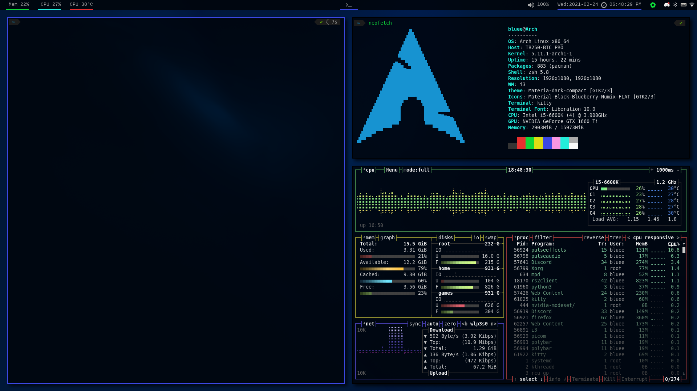

This repository is where I store my dotfiles, and potentially other useful resources I might use.

## Software managed by these dotfiles
[<li>i3 gaps](https://github.com/Airblader/i3) - window manager</li>
[<li>polybar](https://github.com/polybar/polybar) - status bar</li>
[<li>rofi](https://github.com/davatorium/rofi) - application launcher</li>
[<li>picom](https://github.com/yshui/picom) - compositor</li>
[<li>kitty](https://sw.kovidgoyal.net/kitty/) - terminal</li>
[<li>alacritty](https://github.com/alacritty/alacritty) - terminal</li>
[<li>zsh](https://www.zsh.org/) - shell</li>
[<li>fish](https://fishshell.com/) - shell</li>
[<li>Dunst](https://github.com/dunst-project/dunst) - notification viewer</li>

## Software mentioned and/or used in these dotfiles
[<li>bc](https://www.gnu.org/software/bc/) - calculator</li>
[<li>ncmpcpp](https://github.com/ncmpcpp/ncmpcpp) - music player</li>
[<li>Pulseeffects](https://github.com/wwmm/pulseeffects) - audio effects</li>
[<li>lxsession](https://github.com/lxde/lxsession) - polkit</li>
[<li>Feh](https://feh.finalrewind.org/) - image viewer/wallpaper manager</li>
[<li>Flameshot](https://github.com/flameshot-org/flameshot) - screenshot capture</li>

## Fonts used in these dotfiles
[<li>Liberation Mono](https://github.com/liberationfonts/liberation-fonts)</li>
[<li>Nerd fonts fira code](https://github.com/ryanoasis/nerd-fonts)</li>

